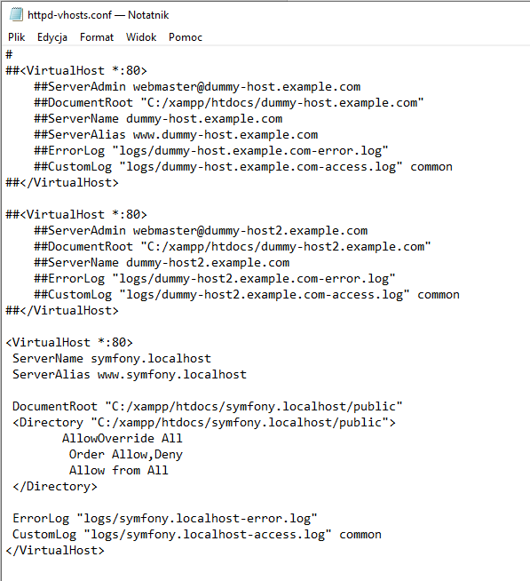

# Instrukcja uruchomienia pojektu
1.	***Instalacja XAMPP***
2.	***Konfiguracja XAMPP (włączenie Apache i MySQL)***
3.	***Konfiguracja pliku httpd-vhosts.conf***
 (zazwyczaj znajduje się on w takiej ścieżce - C:\xampp\apache\conf\extra)
Dodanie do końca pliku: 

4.	***Dodawanie wpisu DNS*** – (zazwyczaj) w ścieżce C:\Windows\System32\drivers\etc\ otwieramy plik hosts i na końcu pliku dopisujemy: 
127.0.0.1 symfony.localhost

5.	***Następnie po wpisaniu do pola przeglądarki adresu : symfony.localhost*** , powinna pojawić się strona.

Dodatkowo załączona jest eksportowana z phpMyAdmin baza danych używana do projektu (znajduje się w folderze: instructions, wraz ze screenami bazy danych). 
Aby wszystkie funkcje (w tym admina) były możliwe do przetestowania najlepiej zaimportować bazę (books.sql).
Przykładowi użytkownicy:
*	Admin:
	Email: admin@php.pl , hasło: admin
*	User:
	Email: manager1@php.pl , hasło: manager1

***UWAGA*** - Jeżeli na początku przejście do innej zakładki na stronie uruchamia Error 404, należy po adresie symfony.localhost, a przed nazwą zakładki dodać :"index.php". 
Następnie wszystko powinno już działać poprawnie.
np. jeśli jest: http://symfony.localhost/books , to zmienić ścieżkę na: http://symfony.localhost/index.php/books . \
Przepraszamy za utrudnienia :slightly_smiling_face:
